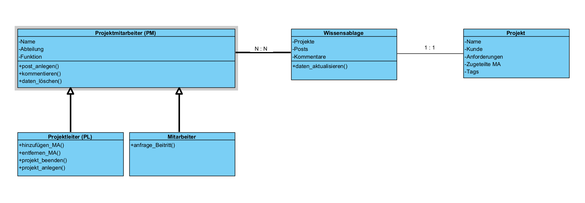

# 6 Klassendiagramm mit Erläuterung
## 6.1 Ausgangsversion des Klassendiagramms

Als Grundlage für die objektorientierte Umsetzung wurde ein Klassendiagramm erstellt. Das Diagramm bildet die wesentlichen Rollen sowie die Verwaltung der projektspezifischen Wissenseinträge ab. Ziel war es, die Struktur möglichst einfach zu halten und zentrale Funktionen an einem Ort zu bündeln.

Das Klassendiagramm besteht aus den Klassen Projekt, Wissensablage und Projektmitarbeiter. Zusätzlich werden die Rollen Projektleiter und Mitarbeiter als Spezialisierungen von Projektmitarbeiter abgebildet.

## 6.2 Klassenbeschreibung
Projekt

Die Klasse Projekt repräsentiert ein Projekt innerhalb der Firma. Ein Projekt enthält die Grunddaten, welche bei der Projekteröffnung erfasst werden müssen.

Attribute:
- Name
- Kunde
- Kernanforderungen
- zugeteilte Mitarbeitende
- Tags

Methoden:
- Projekt anlegen
- Projekt bearbeiten

Damit erfüllt Projekt die Anforderungen zur Projekteröffnung und dient als Zuordnungseinheit für die Wissenseinträge.

Wissensablage

Die Klasse Wissensablage repräsentiert die zentrale Ablage der Wissenseinträge innerhalb der Applikation. Sie kann als zentrale Seite oder als Verwaltungseinheit verstanden werden, in welcher projektrelevante Inhalte gesammelt, verwaltet und durchsucht werden.

Attribute:
- Projekte
- Posts
- Kommentare

Methoden:
- Post erstellen
- Post kommentieren
- Post bearbeiten
- Post löschen
- Projekt zuweisen
- Post suchen

Die Wissensablage bündelt damit den wesentlichen Teil der fachlichen Funktionen. Insbesondere übernimmt sie die Verwaltung von Posts und Kommentaren sowie die Zuordnung zu Projekten und die Suchfunktion nach Tags.

Projektmitarbeiter

Die Klasse Projektmitarbeiter beschreibt Personen, welche in Projekten mitarbeiten und mit der Wissensablage interagieren können.

Attribute:
- Name
- Email
- Tags

Methoden:
- Registrieren
- Projekt beitreten

Projektleiter

Projektleiter ist eine Spezialisierung von Projektmitarbeiter. Der Projektleiter verfügt über zusätzliche Verantwortlichkeiten.

Methoden:
- Projekt anlegen
- Mitarbeiter hinzufügen
- Projekt beenden

Mitarbeiter

Mitarbeiter ist ebenfalls eine Spezialisierung von Projektmitarbeiter. Damit können Mitarbeitende mit grundlegenden Funktionen abgebildet werden.

Methoden:
- Projekt beitreten

## 6.3 Beziehungen und Kardinalitäten
Beziehung Projektmitarbeiter zu Wissensablage

Zwischen Projektmitarbeiter und Wissensablage besteht eine Beziehung mit der Kardinalität N zu N. Dadurch wird modelliert, dass mehrere Mitarbeitende mit mehreren Wissensablagen interagieren können.

Beziehung Wissensablage zu Projekt

Zwischen Wissensablage und Projekt besteht eine Beziehung mit der Kardinalität 1 zu 1. Dadurch wird ausgedrückt, dass eine Wissensablage eindeutig einem Projekt zugeordnet ist.

## 6.4 Interpretation im Kontext der Aufgabenstellung

Die erste Version des Modells versucht, die Komplexität gering zu halten, indem Posts und Kommentare nicht als eigenständige Klassen modelliert werden, sondern als Inhalte innerhalb der Wissensablage verwaltet werden. Die wichtigsten Aktionen, welche in der Aufgabenstellung gefordert sind, werden dadurch zentral in der Wissensablage umgesetzt.

Im Verlauf der Umsetzung zeigte sich jedoch, dass bestimmte Anforderungen mit einer feineren Strukturierung besser abbildbar sind. Diese Erkenntnisse und die daraus resultierende Weiterentwicklung des Klassendiagramms werden im nächsten Abschnitt dokumentiert.

## 6.5 Weiterentwicklung des Klassendiagramms im Verlauf der Umsetzung

Während der Implementierung der ersten Modellversion zeigte sich, dass bestimmte fachliche Anforderungen mit der gewählten Struktur nur eingeschränkt oder mit erhöhtem Aufwand umsetzbar waren.

Insbesondere folgende Punkte führten zu einer Überarbeitung des Modells:
- Jeder Post besitzt mehrere klar definierte Attribute wie Titel, Typ, Inhalt und Tags.
- Pro Post dürfen maximal drei Tags gespeichert werden.
- Kommentare müssen eindeutig einem Post zugeordnet werden.
- Kommentare besitzen eigene Eigenschaften wie Autor, Art und Text.
- Ergänzungen und Korrekturen müssen vom Originaltext unterscheidbar sein.
- Eine strukturierte Persistenz der Daten mittels JSON sollte möglichst eindeutig und nachvollziehbar erfolgen.

In der ursprünglichen Version wurden Posts und Kommentare lediglich als Inhalte innerhalb der Wissensablage verwaltet. Dies führte jedoch dazu, dass die Struktur der Daten zunehmend komplex wurde und Verantwortlichkeiten nicht mehr eindeutig abgegrenzt waren.

Aus diesem Grund wurde das Modell erweitert.

6.6 Erweiterte Modellierung

Zur besseren fachlichen Abbildung wurden zusätzliche Klassen eingeführt:
- Information
- Kommentar

Information

Die Klasse Information repräsentiert einen einzelnen Wissenseintrag innerhalb eines Projektes.

Attribute:
- id
- projekt_id
- titel
- typ
- inhalt oder URL
- tags
- autor
- datum

Eine Information gehört eindeutig zu einem Projekt. Sie kann mehrere Kommentare besitzen.

Kommentar

Die Klasse Kommentar repräsentiert eine Ergänzung zu einer Information.

Attribute:
- id
- information_id
- art
- text
- autor
- datum

Durch das Attribut art kann zwischen Kommentar, Ergänzung und Korrektur unterschieden werden. Dadurch wird die Anforderung erfüllt, dass Änderungen klar vom Originaltext unterscheidbar sein müssen.

## 6.7 Begründung der Weiterentwicklung

Die Einführung der zusätzlichen Klassen führte zu folgenden Vorteilen:
- Klare Trennung der Verantwortlichkeiten
- Bessere Strukturierung der Daten
- Einfachere Validierung der maximal drei Tags
- Saubere Zuordnung von Kommentaren zu Informationen
- Vereinfachte JSON Serialisierung und Rekonstruktion beim Laden
- Bessere Testbarkeit einzelner Funktionen

Die Überarbeitung des Klassendiagramms stellt somit keinen grundlegenden Richtungswechsel dar, sondern eine fachliche Präzisierung, welche sich aus der praktischen Implementierung ergab.

Diese iterative Weiterentwicklung entspricht dem realen Entwicklungsprozess und zeigt den Lernfortschritt im Umgang mit objektorientierter Modellierung.